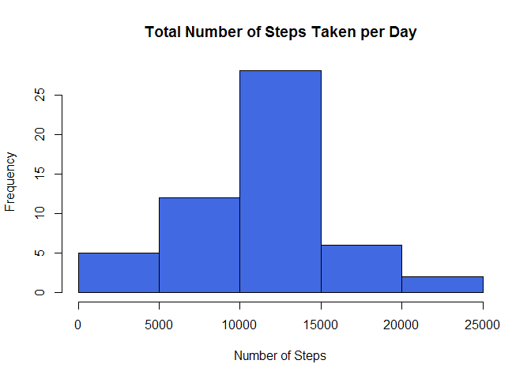
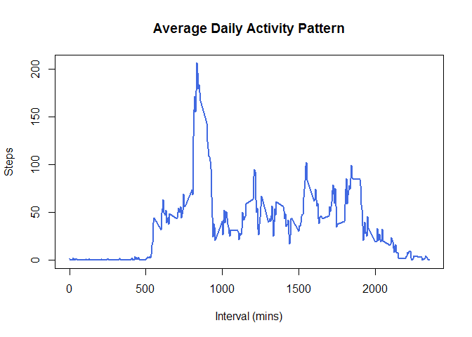
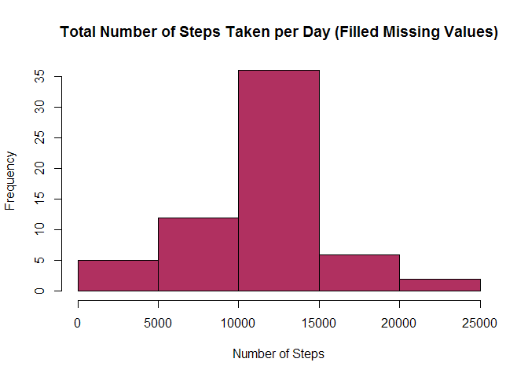
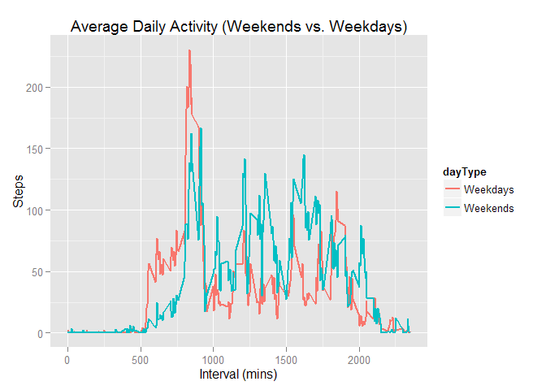

# Reproducible Research: Peer Assessment 1


## Loading and preprocessing the data

* First change/set the current working directory.


```r
setwd("C:/Users/user/Documents/GitHub/RepData_PeerAssessment1")
```

* Load the data 

```r
fileName <- "activity.csv"
activity <- read.csv(fileName, header = TRUE, sep = ",", na.strings = "NA")
```


## What is mean total number of steps taken per day?

For this part of the assignment, you can ignore the missing values in the dataset.

* Make a histogram of the total number of steps taken each day


```r
# Step-1: Preparation of data
TotalStepsDaily <- aggregate(steps ~ date, data = activity, FUN = sum)

# Step-2: Generate the plot/chart
hist(TotalStepsDaily$steps, 
     col = "royalblue",
     main = "Total Number of Steps Taken per Day",
     xlab ="Number of Steps", ylab ="Frequency")
```

 

* Calculate and report the **mean** and **median** total number of steps taken per day

```r
mean(TotalStepsDaily$steps)
```

```
## [1] 10766.19
```

```r
median(TotalStepsDaily$steps)
```

```
## [1] 10765
```
The **mean** and **median** total number of steps taken per day are nearly the same at 10766.19 and 10765 respectively.


## What is the average daily activity pattern?

* Make a time series plot (i.e. type = "l") of the 5-minute interval (x-axis) and 
the average number of steps taken, averaged across all days (y-axis)


```r
# Step-1: Preparation of data
AvgDailyActivity <- aggregate(steps ~ interval, data = activity, FUN = mean)

# Step-2: Generate the plot/chart
plot(steps ~ interval, data = AvgDailyActivity, type = "l",
     lwd = 2, col = "royalblue",
     main = "Average Daily Activity Pattern",
     xlab ="Interval (mins)", ylab ="Steps")
```

 

* Which 5-minute interval, on average across all the days in the dataset, contains the maximum number of steps?


```r
MAXindex <- which.max(AvgDailyActivity$steps)
AvgDailyActivity[MAXindex,]
```

```
##     interval    steps
## 104      835 206.1698
```

The maximum number of steps would be interval **835**, with an average steps of  **206**.


## Imputing missing values

* Calculate and report the total number of missing values in the dataset (i.e. the total number of rows with NAs)


```r
sum(is.na(activity$steps), 
    is.na(activity$date), 
    is.na(activity$interval))
```

```
## [1] 2304
```
**2304** rows are with missing values in the dataset.

* Devise a strategy for filling in all of the missing values in the dataset. The strategy does not need to be sophisticated. For example, you could use the mean/median for that day, or the mean for that 5-minute interval, etc.  

For this part, I will fill in the missing values in the dataset with the mean for that 5-minute interval. 

* Create a new dataset that is equal to the original dataset but with the
missing data filled in.


```r
# Create a new dataset with the missing values 
newActivity <- activity

# Check for missing values and fill them
newActivity <- merge(activity, AvgDailyActivity, by = "interval", suffixes = c("", ".y"))
newActivity$steps <- ifelse(is.na(newActivity$steps), 
                            newActivity$steps.y, newActivity$steps)
```

* Make a histogram of the total number of steps taken each day and Calculate
and report the mean and median total number of steps taken per day. Do
these values differ from the estimates from the first part of the assignment?
What is the impact of imputing missing data on the estimates of the total
daily number of steps?


```r
# Step-1: Preparation of data
NewStepsDaily <- aggregate(steps ~ date, data = newActivity, FUN=sum)

# Step-2: Generate the plot/chart
hist(NewStepsDaily$steps, 
     col = "maroon",
     main = "Total Number of Steps Taken per Day (Filled Missing Values)",
     xlab ="Number of Steps", ylab ="Frequency")
```

 


```r
mean(NewStepsDaily$steps)
```

```
## [1] 10766.19
```

```r
median(NewStepsDaily$steps)
```

```
## [1] 10766.19
```

The **mean** and **median** total number of steps taken per day are the same as a result of imputing the missing data with the mean for that 5-minute interval from the earlier dataset.


## Are there differences in activity patterns between weekdays and weekends?

* Create a new factor variable in the dataset with two levels - "weekday" and "weekend" indicating whether a given date is a weekday or weekend day.


```r
# Convert to class "Date" and define weekedays/weekends
newActivity$days <- weekdays(as.Date(factor(newActivity$date)))

newActivity$dayType <- ifelse(newActivity$days == "Saturday" |
                              newActivity$days == "Sunday", "Weekends", "Weekdays")

# Preparation of data 
AvgDayType <- aggregate(newActivity$steps ~ newActivity$interval + newActivity$dayType, 
                        data = newActivity, FUN=mean)
# Set the names of an object
names(AvgDayType) <- c("interval", "dayType", "steps")
```

* Make a panel plot containing a time series plot (i.e. type = "l") of the 5-minute interval (x-axis) and the average number of steps taken, averaged across all weekday days or weekend days (y-axis). 


```r
# Load the require package
library(ggplot2)

# Generate the plot/chart
g <- ggplot(AvgDayType, aes(x = interval, y = steps, 
                            group = dayType, color = dayType)) + 
        geom_line(size=.8) +
        labs(x = "Interval (mins)", y = "Steps") + 
        labs(title = "Average Daily Activity (Weekends vs. Weekdays)") 
print(g)
```

 
